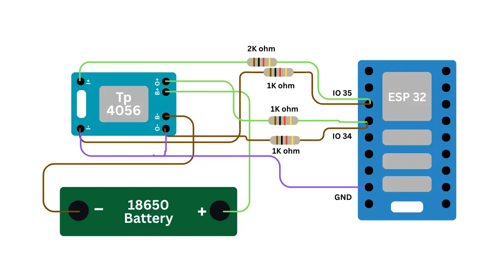

# 🔋 Smart Battery Dashboard V1

A simple ESP32 battery monitoring system that shows real-time battery voltage, percentage, and charging status on a web dashboard.

**Made with ❤️ by [LifeTronix](https://lifetronix.in)**

---

## ✨ Features

- 🔋 Real-time battery voltage monitoring
- 📊 Battery percentage with smart calculation
- ⚡ Charging status detection
- 🌐 Beautiful web dashboard (no app needed)
- 📱 Works on phone, tablet, and desktop
- 🔄 Live updates every 500ms
- 🚀 Simple to set up

---

## 🛠️ What You Need

- ESP32 Development Board
- 18650 Lithium Battery (3.0V - 4.2V)
- TP4056 Charging Module
- 2KΩ Resistor (1 piece)
- 1KΩ Resistor (3 pieces)
- Breadboard & Jumper Wires
- USB Cable for programming

---

## 🔌 Circuit Diagram



### Quick Wiring Guide

**Battery Voltage → GPIO 35** (with 2kΩ + 1kΩ resistor divider)
**Charger Detection → GPIO 34** (with 1kΩ + 1kΩ resistor divider)
**Ground** → Common ground (battery, TP4056, ESP32)

> ⚠️ **Important**: Never connect battery voltage directly to ESP32! Always use the resistor divider shown in the diagram.

---

## 💻 Setup Instructions

### Step 1: Arduino IDE Setup

1. Open Arduino IDE
2. Go to **Preferences** → Add this URL to "Additional Board Manager URLs":
   ```
   https://raw.githubusercontent.com/espressif/arduino-esp32/gh-pages/package_esp32_index.json
   ```
3. Go to **Tools → Board Manager** → Search "esp32" → Install by Espressif Systems
4. Select **Tools → Board → ESP32 Dev Module**
5. Select your **COM Port** and set **Upload Speed to 921600**

### Step 2: Configure Wi-Fi

Open the code and change these lines:

```cpp
const char* WIFI_SSID="your-wifi-name";
const char* WIFI_PASSWORD="your-wifi-password";
```

### Step 3: Build Your Circuit

Follow the circuit diagram above. Connect:
- Battery voltage to GPIO 35 (through resistor divider)
- Charger detection to GPIO 34 (through resistor divider)
- Everything to common ground

### Step 4: Upload Code

1. Connect ESP32 to computer via USB
2. Open the `.ino` file in Arduino IDE
3. Click **Upload** (→ button)
4. Wait for "Hard resetting via RTS pin..." message

### Step 5: Access Dashboard

1. Open **Serial Monitor** at **115200 baud**
2. Look for: `Open: http://192.168.1.100` (or similar IP)
3. Copy that IP address
4. Open it in your phone/computer browser on the **same Wi-Fi**
5. See your battery live! ⚡

---

## 📊 What The Dashboard Shows

| Display | Shows |
|---------|-------|
| 🔋 Battery Icon | Visual battery level 0-100% |
| 📊 Percentage | Current battery % |
| ⚡ Voltage | Battery voltage (e.g., 4.15V) |
| 🟢 Status | Normal / Charging / Low / Full |

---

## ⚡ Battery Status Colors

- 🟢 **Green** - Normal (10-94%)
- 🟠 **Orange** - Charging
- 🔴 **Red** - Low Battery (≤10%)
- ⚪ **Gray** - No Battery Connected

---

## 🔧 Troubleshooting

| Problem | Fix |
|---------|-----|
| Battery shows 0V | Check voltage divider resistors (2kΩ + 1kΩ) |
| Wrong voltage | Verify resistor values with multimeter |
| Can't connect to Wi-Fi | Check SSID and password in code |
| Can't open dashboard | Make sure phone is on same Wi-Fi network |
| Charging detection doesn't work | Check TP4056 CHG pin connection to GPIO 34 |
| Serial Monitor shows garbage | Set baud rate to 115200 |
| Upload fails | Select correct board (ESP32 Dev Module) and COM port |

---

## 📈 Battery Percentage Calculation

The percentage is calculated from battery voltage:

```
4.20V = 100% (Full)
4.10V = 88%
4.00V = 75%
3.80V = 45%
3.50V = 8%
3.30V = 1% (Empty)
```

---

## 🔋 Code Overview

### Main Configuration

```cpp
#define BATTERY_PIN 34           // Voltage reading
#define CHARGER_PIN 35           // Charging detection

const char* WIFI_SSID="your-wifi-name";
const char* WIFI_PASSWORD="your-password";

const float BATTERY_DIVIDER_RATIO=2.0;  // For 2kΩ + 1kΩ
const int SAMPLE_COUNT=15;              // Average 15 samples
const float CHARGER_ON_THRESHOLD=1.0;   // Charging starts
const float CHARGER_OFF_THRESHOLD=0.7;  // Charging stops
```

### Important Functions

**readADCVoltage()** - Reads battery voltage (averages 15 samples)

**calculatePercentage()** - Converts voltage to battery %

**updateBattery()** - Smooths voltage readings

**updateCharger()** - Detects if charging

**getBatteryStatus()** - Returns: Normal / Charging / Low / Full

**handleData()** - Sends data to dashboard (JSON format)

---

## 📚 File Structure

```
project/
├── Smart_Battery_Dashboard.ino     (Main code)
└── README.md                        (This file)
```

---

## ⚖️ License

MIT License - Use freely for personal & commercial projects

---

## 🚀 Tips & Tricks

**Faster Updates**
```cpp
const unsigned long SENSOR_INTERVAL=200;  // was 400 (in milliseconds)
```

**Smoother Readings**
```cpp
const float VOLTAGE_SMOOTHING=0.2;  // was 0.35 (lower = smoother)
```

**More Stable Charging Detection**
```cpp
const float CHARGER_ON_THRESHOLD=1.2;     // was 1.0
const float CHARGER_OFF_THRESHOLD=0.5;    // was 0.7
```

---

## 🎨 Dashboard Features

- **Animated Battery Icon** - Fills up as battery charges
- **Wave Animation** - Shows when charging
- **Live Updates** - Data refreshes every 500ms
- **No External Libraries** - Uses pure HTML/CSS/JavaScript
- **Mobile Friendly** - Responsive design for all screens
- **Dark Theme** - Easy on the eyes

---

## 📞 Need Help?

- 🌐 Website: [lifetronix.in](https://lifetronix.in)
- 📧 Email: contact@lifetronix.in
- 💬 Check serial monitor output for debugging

---

## ⭐ Support

If you like this project:
- Give it a ⭐ on GitHub
- Share with friends
- Subscribe to [LifeTronix](https://youtube.com/@lifetronix)

---

**Version**: 1.0.0
**Status**: ✅ Production Ready
**Last Updated**: August 2026

Made with ❤️ by **LifeTronix**
